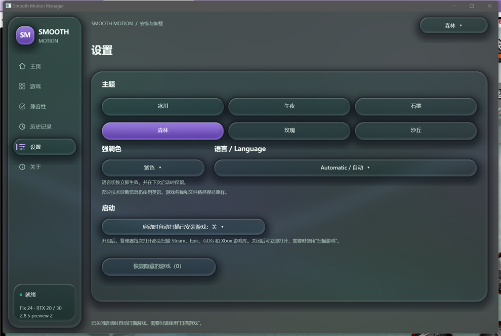

# Manager "scan games at startup" toggle (patch and notes)

**English** | [简体中文](README.md)

This folder contains a patch and notes for one change to the Smooth Motion Manager, provided for
upstream reference and optional integration.

## Base revision (verified)

The patch was produced against the sources shipped inside release **`Smooth Motion 2.8.5 - FIX 1`**
(tag `sm8788`):

| Item | Value |
| --- | --- |
| Release archive | `SmoothMotion-2.8.5-RTX20-RTX30-DX12-Preview2-Fix24-Test.zip` |
| Archive SHA-256 | `339f78eacf0ec22b372dbd320307381a674ac726dc9e6f5e84ff57b57a3844a7` |
| Original `source/manager/manager.cpp` | 69859 bytes · SHA-256 `1c50f7dbf8ed9b7c4ce514f2d05ba71e8d28614cae0d4a848ebc709da6d1b3d7` |
| Original `source/ui/localization.hpp` | 27837 bytes · SHA-256 `16d317c839d67b924690808a59603faa9a82a66d29a1edfc6792643329f328ba` |
| Original `SmoothMotion_Manager.exe` | SHA-256 `a52e7296229bf4baaff9643ef6a8a4e5985fae73f9616a73a1d9593099bbd10e` |

Verified: applying the patch with `git apply -p1` to those original files reproduces the author's
modified revision byte for byte (SHA-256 `f81ce5e9de92986a8078a1fc883500a6ffc9f6cd02fc5214b6be9a7854bacefd`
after newline normalisation).

## Problem

The Manager scans the Steam / Epic / GOG / Xbox libraries on every launch to find installed games.
On machines with large libraries this is slow, and the user cannot turn it off.

## Change

`source/manager/manager.cpp` (5 hunks)

- New `App::autoScanOnStart`, default on, so current behaviour is preserved.
- Preference file bumped to `SM86-PREFS-3`: `theme / accent / startup scan switch`.
  Reads stay compatible with `SM86-PREFS-2` and `SM86-PREFS-1`; a missing switch byte means "on",
  so no migration is required.
- Startup changes from `discover();` to:

  ```cpp
  if(app.autoScanOnStart)discover();else startArtwork();
  ```

  With scanning off the library is not searched; covers for the saved list still load.
- The Settings page gains a "Startup" section with the switch
  (`Scan installed games at startup: On/Off`).

`source/ui/localization.hpp` (1 hunk)

- 8 new English/Chinese UI strings: section title, both switch labels, explanation text,
  activity log entries and a save-failure notice.

## Applying the patch

Extract a release archive, then run this from the package root that contains `source/`:

```sh
git apply -p1 manager-autoscan.patch
```

The patch has 6 hunks and 113 lines. If the context does not match (for example when the maintainer's
internal revision is newer than `sm8788`), apply the hunks manually.

## Verification

| Case | Result |
| --- | --- |
| Start with the switch off | No scan entries in the activity log, ready in ~5 s (covers still load) |
| Start with the switch on | Unchanged behaviour, "Finding installed games and their launch executables…" |
| Toggle the switch in Settings | Preference flips `0 ↔ 1` and persists; the activity log reports it |
| Revert to an older preference file | Behaviour unchanged (auto-scan stays on) |

Screenshot:



## Build

```sh
python source/manager/build.py --zig /path/to/zig --package-root /path/to/package-root
```

Zig 0.14.1 or LLVM-MinGW work as the cross-compiler (see `BUILD.md` inside the package).

## Note

The Manager sources are not part of this repository's git tree; they ship inside the release
archives only. This pull request therefore provides the change as a patch plus notes, which the
maintainer can fold into the next release source snapshot.
